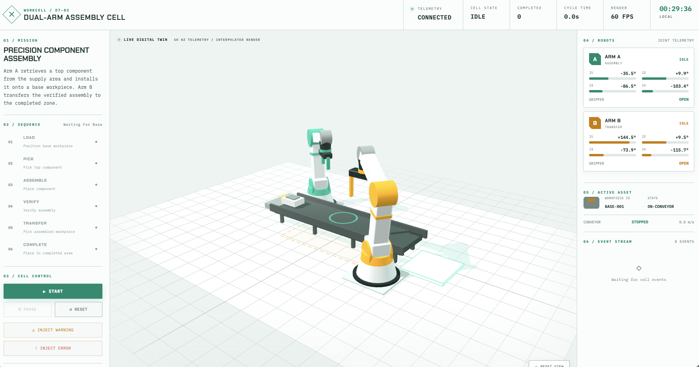

# Dual-Arm Assembly Cell Digital Twin

[](https://github.com/kaiqiwang4493/Robot_RealTime_Mointor/actions/workflows/ci.yml)


> A browser-based, real-time digital twin for a collaborative dual-arm robotic assembly cell.

**Live demo:** <https://robot-realtime-monitor.onrender.com>

> ⚠️ **Cold start notice:** This app runs on Render's free tier, which spins down after inactivity. **The first visit may take 50 seconds or more to load** — please be patient and wait for the page to fully appear before interacting.

## Project Overview

This project demonstrates how a production-oriented frontend can monitor a robotic workcell in real time. A Node.js simulator acts as the authoritative controller and streams 10 Hz telemetry to an Angular operator interface. Three.js interpolates the latest state inside a 60 FPS render loop to create a smooth digital twin.

The application does **not** control physical hardware. It is a portfolio project focused on real-time frontend architecture, industrial UX, operational safety states, and 3D visualization.

## Screenshots



## Features

- Live 3D view of two articulated robot arms, a conveyor, supply area, workpieces, assembly station, safety zone, and completed area
- Deterministic dual-arm assembly workflow with server-authoritative state
- Robot joint angles, gripper state, conveyor speed, workpiece identity, cycle time, throughput, and render FPS
- Smooth interpolation between 10 Hz telemetry frames
- Start, pause, reset, warning injection, error injection, and camera controls
- Non-blocking alignment warning
- Cell-wide safe stop after a verification fault
- Timestamped operational event stream
- Automatic WebSocket reconnection and stale-telemetry overlay
- Responsive desktop and tablet layouts

## Simulated Manufacturing Workflow

1. The conveyor positions a base workpiece at the assembly station.
2. Arm A retrieves a top component from the supply area.
3. Arm A places the component onto the base workpiece.
4. A simulated vision step verifies the assembly.
5. Arm A leaves the shared work zone.
6. Arm B picks the assembled workpiece from the conveyor.
7. Arm B transfers the complete assembly to the completed zone.
8. The throughput counter increments and the next cycle begins.

After placement, the top component stores an `attachedTo` reference to the base workpiece. Its world position is then derived from the base position, so both parts move together when Arm B transfers the assembly.

## Warning and Error Scenarios

### Warning

`ALIGNMENT_TOLERANCE` simulates Arm A approaching its component placement tolerance. The assembly station and Arm A receive an amber visual treatment, an event is added to the stream, and production continues.

### Error

`VERIFICATION_FAILED` simulates a failed component placement check. The backend preserves the current workpiece positions, stops both robots and the conveyor, marks every robot as faulted, and requires an operator reset before another cycle can begin.

## System Architecture

```text
Browser
├── Angular operator interface
├── Angular Signals view state
├── RxJS / native WebSocket transport
└── Three.js digital twin
          │
          │ HTTPS + WSS
          ▼
Node.js web service
├── Angular static file host
├── WebSocket endpoint: /telemetry
├── Assembly state machine
├── Robot trajectory generator
├── Workpiece attachment model
└── Warning and error injection
```

Production uses one origin for both HTTP and WebSocket traffic. This removes CORS configuration and automatically selects secure `wss://` transport when the page is served over HTTPS.

## Frontend Architecture

- `TelemetryService` owns the connection lifecycle, validates sequence order, ignores malformed messages, reconnects after disconnects, and exposes Angular Signals.
- `App` composes operator controls, telemetry panels, process state, and the event stream with `OnPush` change detection.
- `WorkcellScene` owns all Three.js resources. Its animation loop runs outside Angular change detection and disposes geometries, materials, controls, and observers when destroyed.
- The scene interpolates current transforms toward the latest server frame instead of binding 3D objects directly to network updates.

## Backend Simulation

The Node.js service is the single source of truth. It advances a deterministic state machine through:

```text
positioning-base → picking-component → placing-component
→ verifying-assembly → picking-assembly
→ placing-completed → cycle-complete
```

Robot motion is generated from predefined joint-space key poses. Each state computes eased joint angles and workpiece positions based on elapsed state time. This is deliberately not inverse kinematics or physics simulation; it provides repeatable, explainable telemetry for the frontend.

The server:

- publishes telemetry every 100 ms
- owns production state and metrics
- attaches the top component to the base after placement
- broadcasts discrete operational events separately from telemetry
- freezes state when paused or faulted
- sends a full snapshot to every newly connected or reconnected browser
- accepts only known operator commands

## WebSocket Message Contract

Telemetry messages use this envelope:

```ts
type ServerMessage =
  | { type: 'snapshot' | 'telemetry'; data: TelemetryFrame }
  | { type: 'event'; data: CellEvent };
```

Client commands are:

```ts
type ClientCommand =
  | { type: 'start' | 'pause' | 'reset' }
  | {
      type: 'inject-warning' | 'inject-error';
      target: 'arm-a' | 'arm-b' | 'conveyor';
    };
```

The complete shared contracts are in `src/app/models.ts`.

## Technology Stack

- Angular 22 and TypeScript
- Angular Signals and RxJS
- Three.js and WebGL
- Node.js and Express
- `ws` WebSocket server
- Vitest and Angular component tests
- Playwright browser tests
- GitHub Actions continuous integration
- Render Web Service deployment

## Local Development

Requirements:

- Node.js 22.22.3 or newer supported LTS release
- npm 10+

Install dependencies and start both services:

```bash
npm ci
npm run dev
```

Open `http://localhost:4200`. The Angular development client automatically connects to `ws://localhost:8080/telemetry`.

To test the production-style single-origin server:

```bash
npm run build
npm start
```

Open `http://localhost:8080`.

## Testing

```bash
npm run typecheck
npm run test:server
npm run test:frontend
npx playwright install chromium
npm run test:e2e
npm run build
```

The server tests cover state transitions, non-blocking warnings, safe-stop errors, component attachment, and cycle completion. The browser test covers connection, cycle start, fault injection, and the reset affordance.

## Deployment

### Render Blueprint

1. Push this repository to GitHub.
2. The CI badge already points to `kaiqiwang4493/Robot_RealTime_Mointor`.
3. In Render, select **New → Blueprint**.
4. Connect the repository and select `render.yaml`.
5. Wait for the Angular production build and Node service deployment.
6. Open the generated `onrender.com` URL.
7. Add that URL to the **Live demo** section above.

The included blueprint:

- uses Node.js 24.15.0
- runs `npm ci && npm run build`
- starts the Node service with `npm start`
- exposes `/health` for deployment health checks
- waits for GitHub checks before auto-deploying

The server binds to Render's `PORT` on `0.0.0.0`. Public WebSocket clients connect to the same host at `/telemetry`; HTTPS pages automatically use WSS.

### Custom Domain

Add a custom domain in the Render service settings, update DNS with your provider, and allow Render to issue the managed TLS certificate. No application code changes are required.

## Known Limitations

- No physical robot or PLC is connected.
- Motion uses keyframed joint trajectories, not inverse kinematics.
- There is no collision or rigid-body physics engine.
- Vision verification is simulated.
- State is in memory and resets when the server restarts.
- The first Render free-tier request may experience a cold start.
- Procedural robot geometry favors clarity and performance over manufacturer fidelity.

## Future Improvements

- Replace the simulator with a ROS 2, OPC UA, or Intrinsic platform gateway
- Import manufacturer robot models in optimized glTF format
- Add telemetry recording, replay, and cycle comparison
- Add collision envelopes and near-miss visualization
- Add configurable assembly recipes and robot types
- Add time-series charts and production OEE metrics
- Move scene interpolation into a dedicated worker for larger workcells

## Safety Notice

This software is a visualization demonstration and is not certified for robot control, functional safety, or production use.
